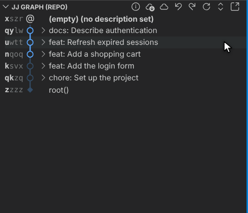
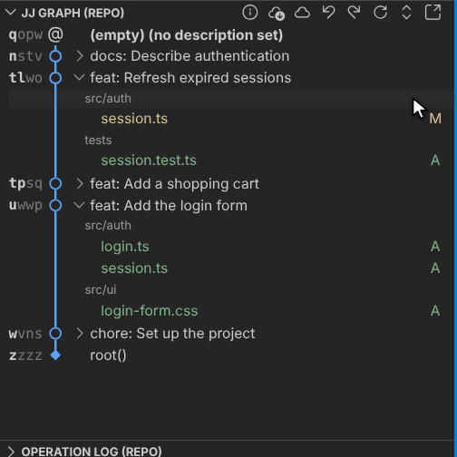
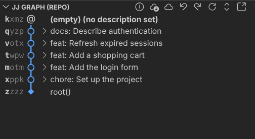
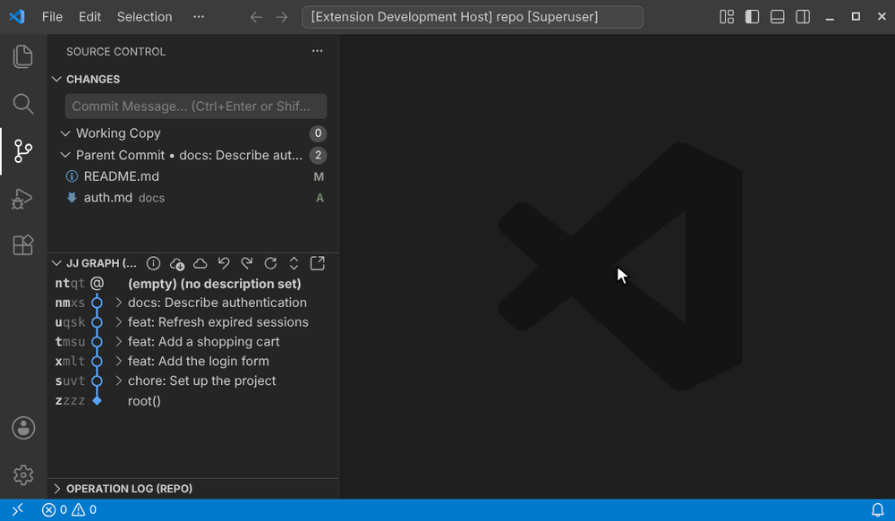

# Juju


> **Juju is a heavily modified fork of [Jujutsu X (jjx)](https://github.com/Christoph-D/jjx)** by Christoph Dittmann.
> Jujutsu X is a VS Code extension for the [Jujutsu (jj)](https://github.com/jj-vcs/jj) version control system with an
> interactive commit graph, drag & drop rebasing and squashing, an operation log, conflict resolution in the VS Code
> merge editor, and much more. If you are looking for the original, well-maintained extension, use Jujutsu X. Juju
> builds on top of it and experiments with a more direct, hands-on way of editing history right in the graph.

## ✨ What Juju Adds

### 📂 Expandable Commits

Every change in the graph can be expanded to show the files it touches, grouped by directory, like `jj log -s`. Click
the arrow next to a change (or press `ArrowRight` / `ArrowLeft` on the selected change) to expand or collapse it. Files
are selectable rows: click, `Ctrl`+click, and `Shift`+click select them, double-click opens the diff, and the context
menu offers the same actions as the Source Control view, including discarding the changes of the selected files.



### 🖱️ Dragging Changed Files

Drag a changed file, or several selected files, onto another change to move their changes there. Hold `Ctrl` (`Cmd` on
macOS) while dropping a file onto the edge between two changes to move it into a brand-new change at that place, without
leaving your current working copy.



### ➕ Inserting Changes in Between

Hold `Ctrl` (`Cmd` on macOS) and the edges between changes light up as you hover them:

- **`Ctrl`+drag** a change onto an edge to rebase it exactly there: in between two changes, onto a change (top edge) or
  before a change (bottom edge)
- **`Ctrl`+double-click** an edge to insert a new empty change there (`jj new -A` / `jj new -B`) and start working in it



### 🗂️ Graph in an Editor Tab

Open the graph in a regular editor tab with the "Open Graph in Tab" button in the JJ Graph toolbar (or the
`Jujutsu: Open Graph in Tab` command) to give it all the room it needs. The tab has the full graph toolbar, and its
selection stays in sync with the graph in the side bar.



### 🔧 Smaller Improvements

- Double-clicking a change runs `jj edit` on changes without a description and `jj new` otherwise (configurable with
  `juju.changeDoubleClickAction`)
- Dragged bookmarks are highlighted and previewed on the drop target
- The graph, Source Control view, and operation log are refreshed from a single repository snapshot, which keeps them
  consistent and fast

## 📦 Everything Else

All the other features of Jujutsu X are still here: the compact commit graph with elided commits, drag & drop rebase,
squash, duplicate, and revert, context menus for changes, bookmarks, and tags, the details view, interactive split,
conflict resolution, divergent change handling, multi-workspace support, and the operation log with undo/redo. See the
[Jujutsu X README](https://github.com/Christoph-D/jjx#readme) for a full tour.

## 📋 Requirements

- [`jj`](https://github.com/jj-vcs/jj) 0.38.0 or newer, either on your `$PATH` or configured with `juju.jjPath`
- VS Code 1.125.0 or newer

## ⚙️ Settings

All settings live under the `juju.` prefix. The most useful ones:

| Setting                         | Default                | Description                                                                       |
| ------------------------------- | ---------------------- | --------------------------------------------------------------------------------- |
| `juju.showChangedFiles`         | `true`                 | Make changes in the graph expandable to show their changed files                  |
| `juju.changeDoubleClickAction`  | `"newEditUndescribed"` | What double-clicking a change does: `"edit"`, `"new"`, or `"newEditUndescribed"`  |
| `juju.graphStyle`               | `"compact"`            | `"compact"` shows one line per change, `"full"` shows all details                 |
| `juju.logLimit`                 | `500`                  | Maximum number of changes shown in the graph                                      |
| `juju.jjPath`                   | `""`                   | Path to the `jj` executable; searched on `$PATH` and common locations if empty    |
| `juju.enableAnnotations`        | `true`                 | Show inline blame annotations with the change that last touched each line         |
| `juju.autoUpdateStaleWorkspace` | `true`                 | Run `jj workspace update-stale` automatically when the working copy becomes stale |
| `juju.pollIntervalSeconds`      | `30`                   | Seconds between repository polls, `0` disables polling                            |

Disable VS Code's built-in Git extension (`git.enabled`) in jj repositories to avoid duplicate file decorations.

## 🛠️ Development

```shell
pnpm install
pnpm run build       # build the extension
pnpm run check       # type check, lint, format check, unit tests
pnpm run test        # unit and integration tests
```

The animations in this README are recorded from a real VS Code instance by `pnpm run update-animations` (requires `Xvfb`
and `ffmpeg`).

## 🐛 Issues

Please report problems with Juju on [GitHub](https://github.com/P-i-N/juju/issues/), not to the Jujutsu X project.

## 🙏 Acknowledgements

Juju is a fork of [Jujutsu X](https://github.com/Christoph-D/jjx) by Christoph Dittmann, which in turn is based on
[Jujutsu Kaizen](https://github.com/keanemind/jjk).

## 📝 License

This project is licensed under the [AGPL-3.0 License](LICENSE). Code from the original project
[Jujutsu Kaizen](https://github.com/keanemind/jjk) is licensed under the MIT License. See [LICENSE.md](LICENSE.md) for
details.
